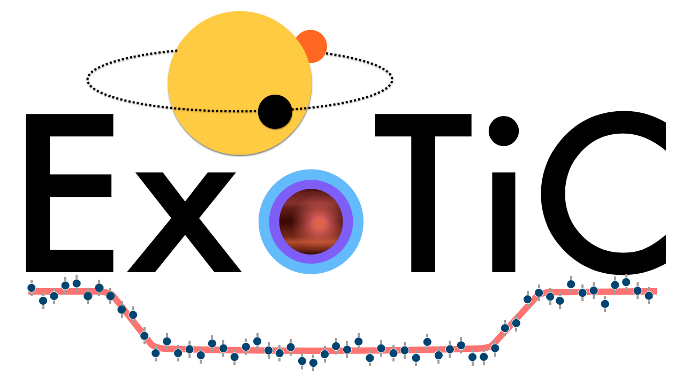

<!--  -->

# Welcome to ExoTiC
Exoplanet Timeseries Characterisation Software and Programs are developed and maintained by the ExoTiC Team at the University of Bristol led by H.R. Wakeford.

## [ExoTiC-ISM](https://github.com/Exo-TiC/ExoTiC-ISM)
Instrument Systematic Marginalisation package to work with Hubble WFC3 time series data. 

## [ExoTiC-LD](https://exo-tic.github.io/ExoTiC-LD/)
A limb darkening calculator using 1D Kurucz or 3D Magic stellar models. 

## [ExoTiC-MIRI](https://exotic-miri.readthedocs.io/en/latest/)
A package with custom tools to work with the JWST MIRI pipeline for stages 1 and 2.

### Acknowledgments

* Hannah Wakeford, Lecturer, University of Bristol - [hrwakeford](https://github.com/hrwakeford)
* David Grant, Postdoc, University of Bristol - [davogrant](https://github.com/DavoGrant)
* Lili Alderson, Grad-student, University of Bristol - [lili-alderson](https://github.com/lili-alderson)

<!-- You can use the [editor on GitHub](https://github.com/Exo-TiC/exotic.github.io/edit/gh-pages/index.md) to maintain and preview the content for your website in Markdown files. -->

<!-- Whenever you commit to this repository, GitHub Pages will run [Jekyll](https://jekyllrb.com/) to rebuild the pages in your site, from the content in your Markdown files. -->

<!-- ### Markdown

Markdown is a lightweight and easy-to-use syntax for styling your writing. It includes conventions for

```markdown
Syntax highlighted code block

# Header 1
## Header 2
### Header 3

- Bulleted
- List

1. Numbered
2. List

**Bold** and _Italic_ and `Code` text

[Link](url) and 
```

For more details see [Basic writing and formatting syntax](https://docs.github.com/en/github/writing-on-github/getting-started-with-writing-and-formatting-on-github/basic-writing-and-formatting-syntax). -->

<!-- ### Jekyll Themes

Your Pages site will use the layout and styles from the Jekyll theme you have selected in your [repository settings](https://github.com/Exo-TiC/exotic.github.io/settings/pages). The name of this theme is saved in the Jekyll `_config.yml` configuration file. -->
<!-- 
### Support or Contact

Having trouble with Pages? Check out our [documentation](https://docs.github.com/categories/github-pages-basics/) or [contact support](https://support.github.com/contact) and we’ll help you sort it out. -->
